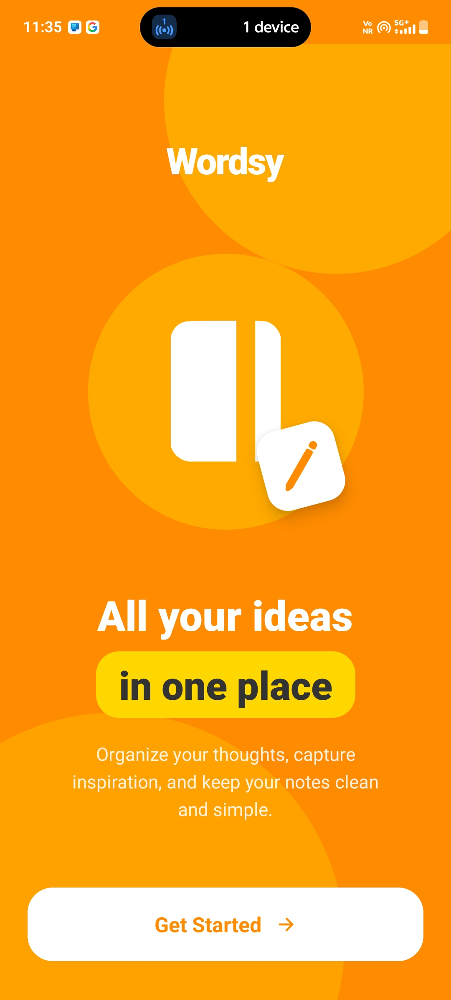
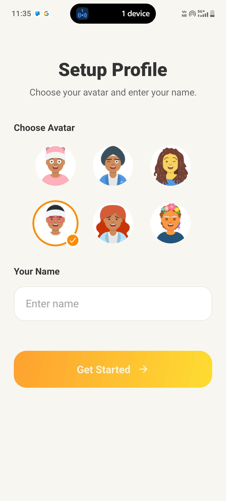
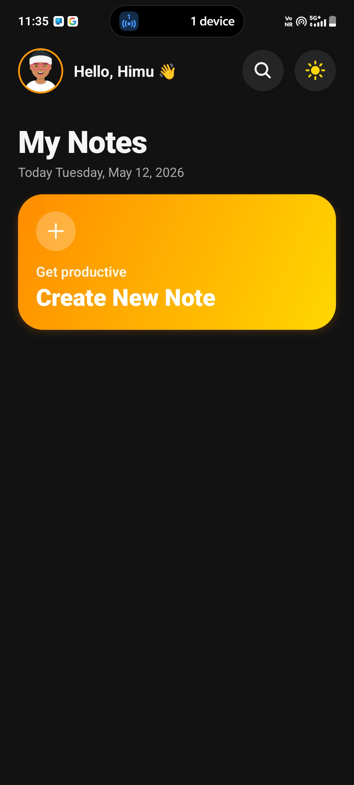
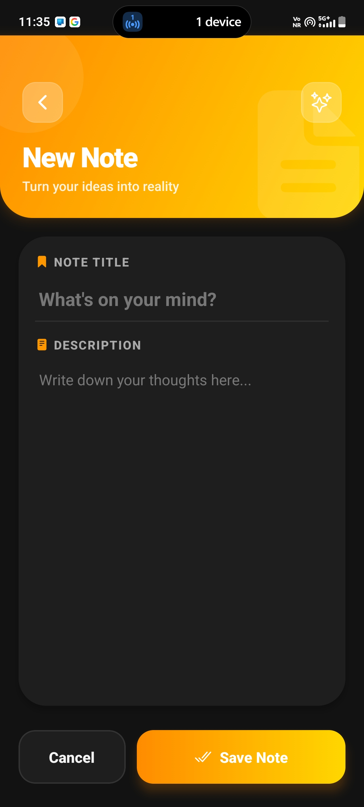
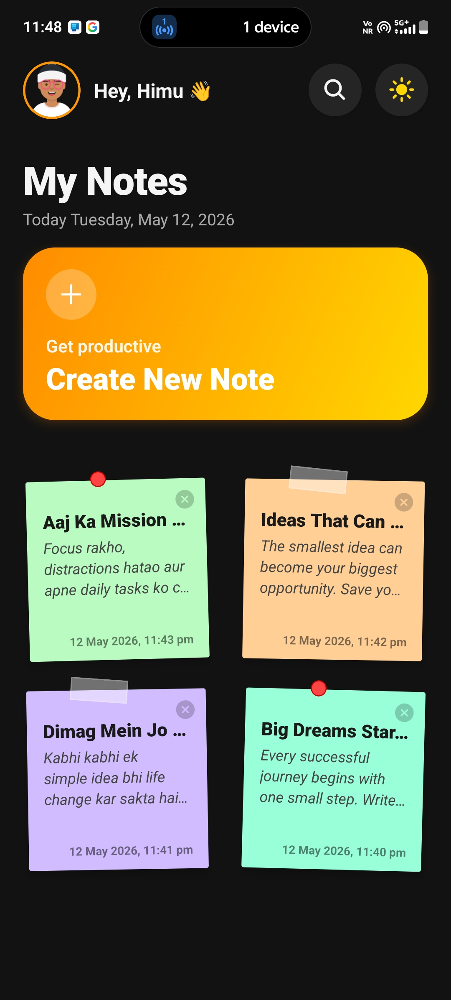
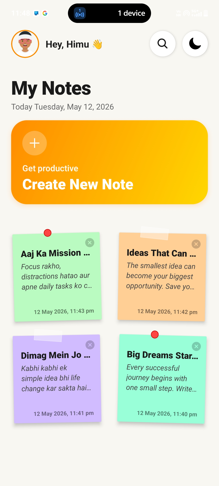
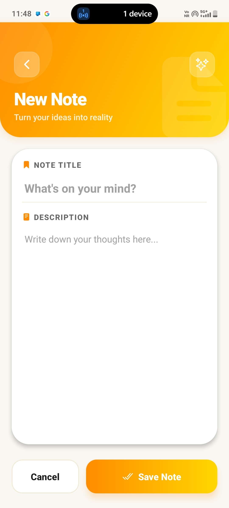
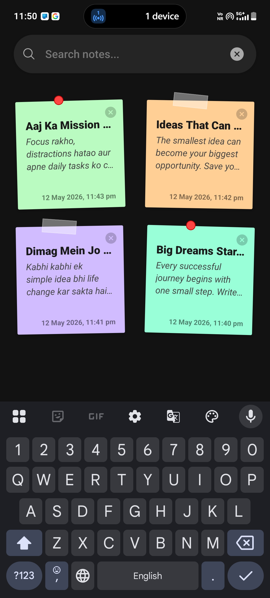

# Wordsy - Premium Sticky Notes App 👋

**Wordsy** is a sophisticated, offline-first notes application designed for users who appreciate both aesthetics and functionality. Built with a modern **Sticky Note** theme and a vibrant **Orange-Yellow** color palette, it offers a high-end, native experience for organizing thoughts, missions, and ideas.

Developed by **H. Anand**, this project demonstrates premium mobile UI/UX principles, robust local data persistence, and intuitive gesture-based navigation.

---

## 📸 App Showcase

<div align="center">
  
  
  
  
</div>

<div align="center">
  
  
  
  
</div>

---

## ✨ Key Features

- **Premium Post-it Aesthetic**: A unique visual style featuring pastel colors, decorative washi tapes, and pushpin icons for a nostalgic sticky-note feel.
- **Personalized Onboarding**: Profile setup with a choice of 6 happy young-adult avatars and personalized dashboard greetings.
- **Persistent Local Storage**: Full offline support using `AsyncStorage`. Your notes and profile stay secure on your phone.
- **Dynamic Search**: Real-time filtering system to find your notes instantly.
- **Theme Toggle**: Seamless switching between a vibrant Light mode and a sleek Dark mode (with a professional midnight black theme).
- **Interactive Detail View**: A stylish, centered modal view for reading long notes without cluttering the main dashboard.
- **Native Gesture Support**: Intelligent handling of Android hardware back buttons to navigate between search, modals, and screens.
- **Session Management**: Flexible logout options to either clear only the profile or completely wipe all data for a fresh start.

---

## 🛠️ Tech Stack

- **Core**: [React Native](https://reactnative.dev/)
- **Framework**: [Expo](https://expo.dev/) (SDK 55)
- **Navigation**: [Expo Router](https://docs.expo.dev/router/introduction/) (File-based routing)
- **Persistence**: [@react-native-async-storage/async-storage](https://react-native-async-storage.github.io/async-storage/)
- **Styling**: Vanilla React Native StyleSheet with [Expo Linear Gradient](https://docs.expo.dev/versions/latest/sdk/linear-gradient/)
- **Icons**: [@expo/vector-icons](https://icons.expo.fyi/) (Ionicons)

---

## 🚀 Getting Started

To get a local copy up and running, follow these simple steps:

### Prerequisites
- Node.js installed
- Expo Go app on your mobile device (to test) or an Android/iOS emulator

### Installation

1. **Clone the repository**
   ```bash
   git clone https://github.com/h-anand21/mobile-development.git
   ```

2. **Navigate to the project directory**
   ```bash
   cd Project-2-NotesApp
   ```

3. **Install dependencies**
   ```bash
   npm install
   ```

4. **Start the development server**
   ```bash
   npx expo start
   ```

5. **Run on your device**
   - Scan the QR code with your **Expo Go** app (Android) or Camera app (iOS).
   - Or press `a` for Android emulator or `i` for iOS simulator.

---

## 👨‍💻 Author

**H. Anand**
- [GitHub Profile](https://github.com/h-anand21)

---

## ⚖️ License
Distributed under the MIT License. See `LICENSE` for more information.

---
*Created with ❤️ for a premium note-taking experience.*
