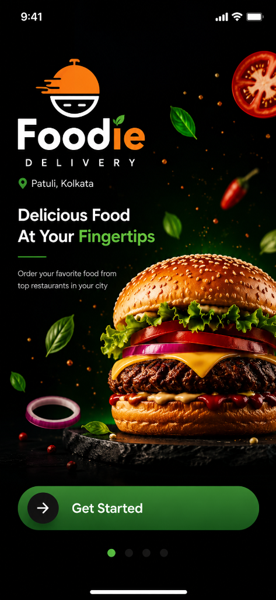
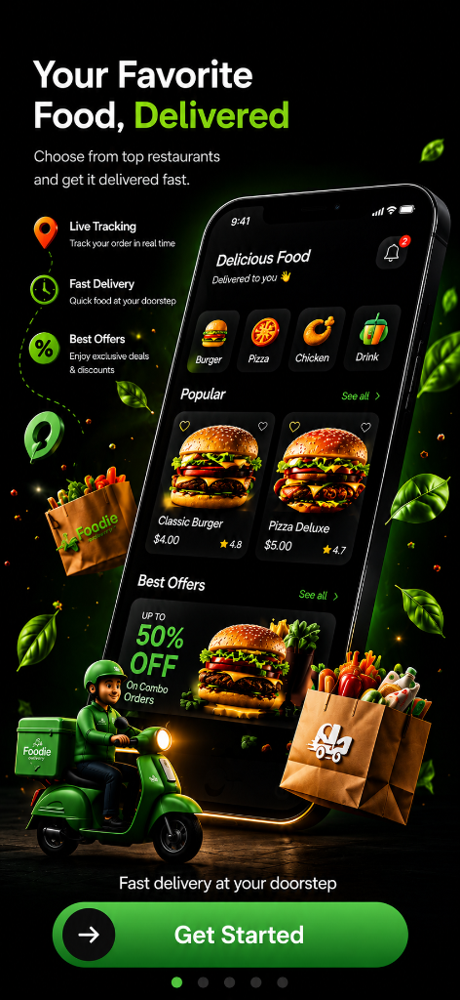
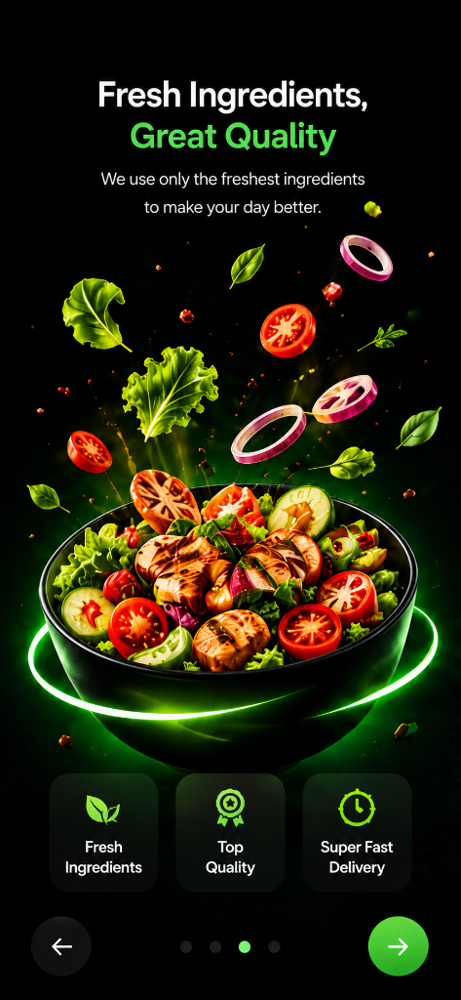
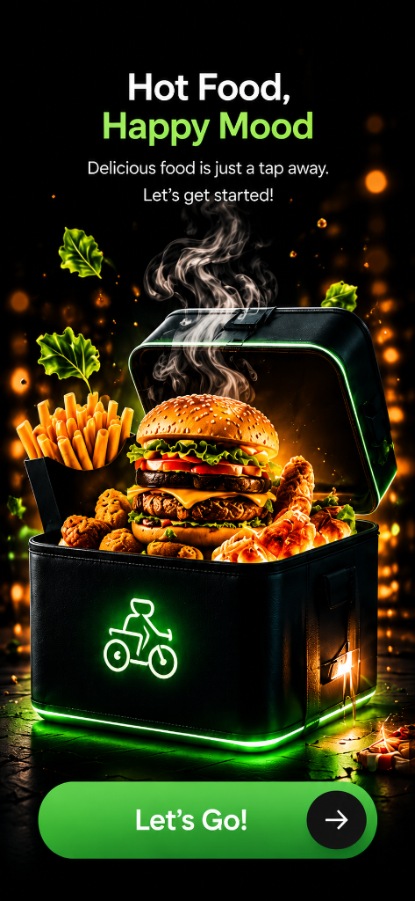
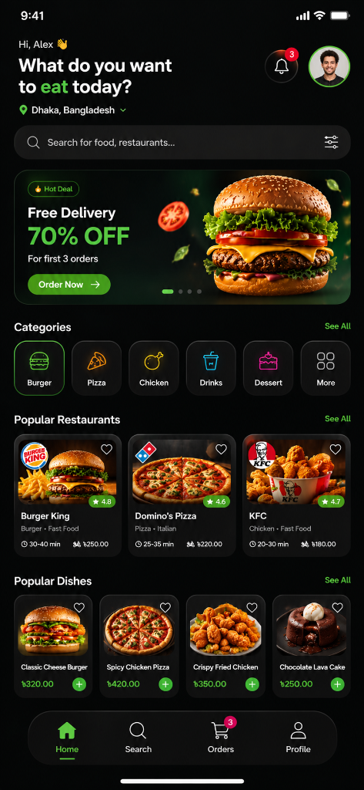
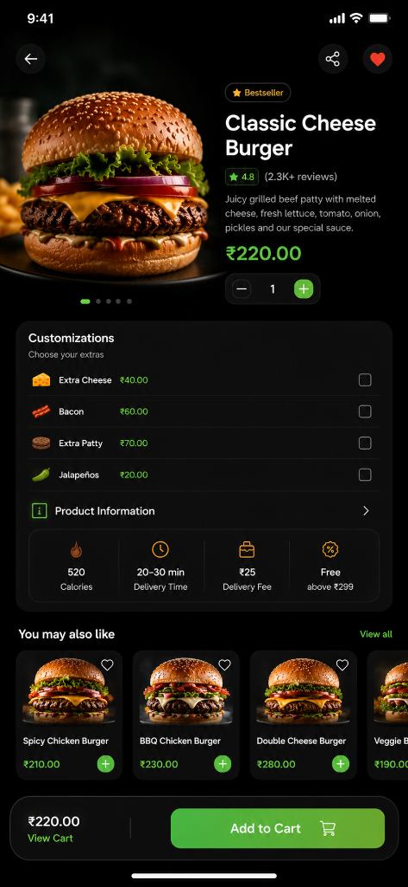
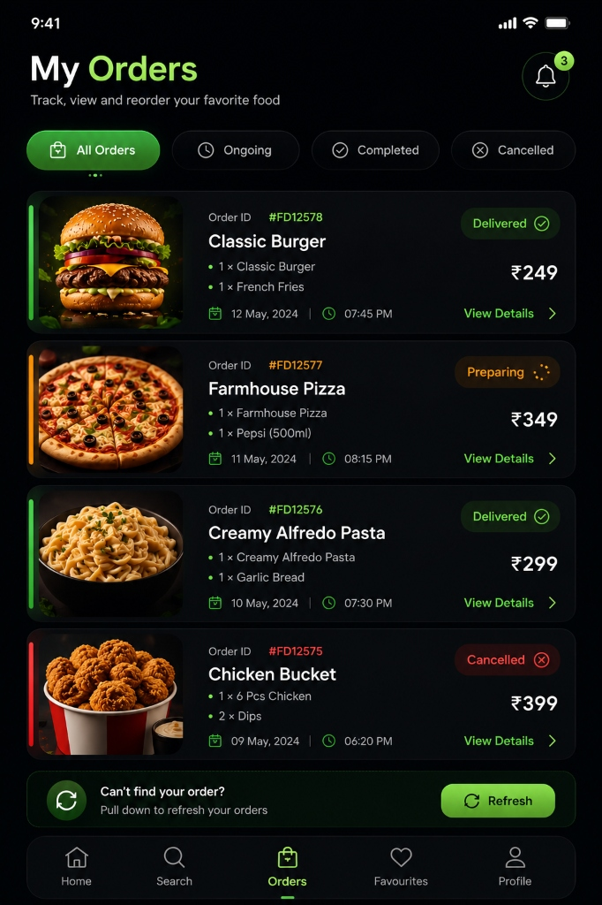
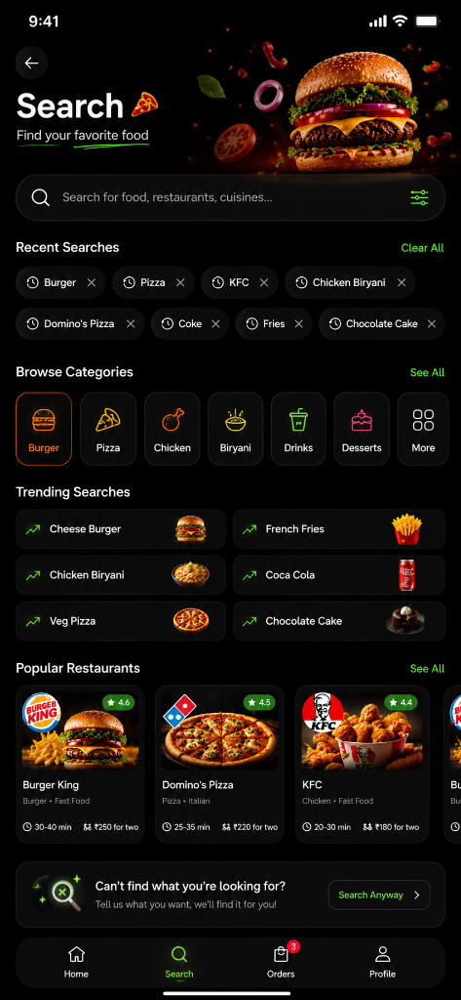
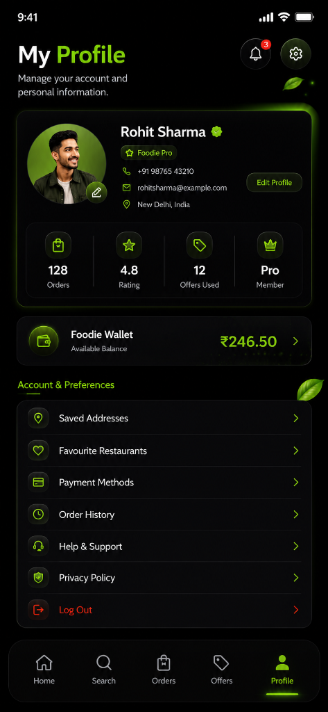

# 🍔 Foodie — Premium Food Delivery App

<p align="center">
  
</p>

<p align="center">
  A full-featured, production-ready <strong>Food Delivery App</strong> built with <strong>React Native + Expo</strong>.<br/>
  Dark-themed premium UI, smooth navigation, real cart & order management — all offline-ready.
</p>

<p align="center">
  
  
  
  
  
</p>

---

## 📸 App Screens & Features

---

### 🚀 Onboarding — 4 Screens

<p align="center">
  
  &nbsp;
  
  &nbsp;
  
  &nbsp;
  
</p>

- Full-screen food photography backgrounds  
- Smooth horizontal swipe between slides  
- Skip button + dot indicators  
- Auto-redirects to Login after first launch  

---

### 🏠 Home Feed

<p align="center">
  
</p>

- Greeting with user name + location (Patuli, Kolkata)  
- **Auto-scrolling Promo Carousel** — Hot Deal, Pizza Fiesta, Crispy Chicken  
- **Category Filter** — Burger, Pizza, Chicken, Drinks, Dessert, More  
- **Restaurant Cards** — image, rating, delivery time, delivery fee  
- **Popular Dishes Grid** — 2-column layout with ＋ Add to Cart  
- All prices in **₹ (Indian Rupee)**  

---

### 🍽️ Restaurant Detail

<p align="center">
  
</p>

Each restaurant opens its own screen:

| Restaurant | Categories |
|---|---|
| **Burger King** | Burgers, Combos, Sides, Beverages, Desserts |
| **Domino's Pizza** | Pizzas, Pasta, Sides, Beverages, Desserts |
| **KFC** | Chicken, Burgers, Combos, Snacks, Beverages |
| **Pizza Hut** | Pizzas, Pasta, Sides, Beverages |

- Hero image + restaurant logo + Open badge  
- ⭐ Ratings, 🕐 Delivery time, 🚴 Delivery fee  
- Offer banner with APPLY button (e.g., FLAT ₹100 OFF)  
- 🔍 Search dishes within restaurant  
- Sticky category tabs while scrolling  
- **＋ Add / − Remove** per-item quantity controls  
- Bestseller / Popular / Must Try badges  
- Floating **"View Cart →"** bar when items added  

---

### 📦 Orders

<p align="center">
  
</p>

- Filter tabs: **All / Ongoing / Completed / Cancelled**  
- Live order status with cancel option  
- Order ID, timestamp, items and price (in ₹)  

---

### 🔍 Search

<p align="center">
  
</p>

- Full restaurant + dish search  
- Browse by category, trending searches  
- Recent search history with clear option  
- Popular Restaurants grid  

---

### 👤 Profile

<p align="center">
  
</p>

- User info card (name, phone, email, location)  
- **Foodie Pro** badge + ✅ verified checkmark  
- Stats: **Orders · Rating · Offers Used · Member tier**  
- 💳 **Foodie Wallet** with ₹ balance  
- Account menu: Saved Addresses, Favourites, Payment Methods, Order History, Help & Support, Privacy Policy  
- **Log Out** button  

---

---

## 🛠️ Tech Stack

| Technology | Usage |
|---|---|
| **React Native** | Core mobile framework |
| **Expo SDK 55** | Build tooling, managed workflow |
| **Expo Router v3** | File-based routing, deep linking |
| **TypeScript** | Strict type safety throughout |
| **Zustand** | Global state (cart, orders, auth) |
| **AsyncStorage** | Persistent auth session |
| **expo-splash-screen** | Seamless native → JS splash |
| **expo-status-bar** | Dark status bar on all screens |
| **@expo/vector-icons** | Ionicons throughout |
| **react-native-safe-area-context** | Safe area inset handling |
| **react-native-reanimated** | Smooth animations |

---

## 📁 Project Structure

```
Project-3-food-delivery-app/
├── app/
│   ├── _layout.tsx              ← Root layout (auth redirect logic)
│   ├── (auth)/
│   │   ├── _layout.tsx
│   │   ├── onboarding.tsx       ← 4-slide onboarding
│   │   └── login.tsx            ← Login screen
│   └── (tabs)/
│       ├── _layout.tsx          ← Bottom tab bar
│       ├── home/
│       │   ├── _layout.tsx      ← Home stack
│       │   ├── index.tsx        ← Main feed
│       │   ├── cart.tsx         ← Cart screen
│       │   ├── restaurant/
│       │   │   └── [id].tsx     ← Dynamic restaurant detail
│       │   └── product/
│       │       └── [id].tsx     ← Product/dish detail
│       ├── search.tsx           ← Search & filter
│       ├── orders.tsx           ← Order tracking
│       └── profile/
│           ├── _layout.tsx      ← Stack (no extra nav)
│           └── index.tsx        ← Profile screen
├── assets/
│   ├── image-of-front/          ← Onboarding images (1–4.png)
│   └── images/                  ← App images (restaurants, dishes, logos)
├── components/
│   ├── Button.tsx
│   ├── FoodCard.tsx
│   └── CustomDrawerContent.tsx
├── constants/
│   └── Theme.ts                 ← Design tokens (colors, spacing, etc.)
└── store/
    ├── authStore.ts             ← Auth state (persisted)
    ├── cartStore.ts             ← Cart state
    └── orderStore.ts            ← Order management
```

---

## ⚡ Quick Start

### Prerequisites
- Node.js 18+
- Expo CLI: `npm install -g expo-cli`
- **Expo Go** app on your phone ([Android](https://play.google.com/store/apps/details?id=host.exp.exponent) | [iOS](https://apps.apple.com/app/expo-go/id982107779))

### Installation

```bash
# 1. Clone the repository
git clone https://github.com/h-anand21/mobile-development.git
cd mobile-development/Project-3-food-delivery-app

# 2. Install dependencies
npm install

# 3. Start the development server
npx expo start -c
```

### Running on Device / Emulator

| Platform | Command |
|---|---|
| 📱 **Physical device** | Scan QR code with Expo Go app |
| 🤖 **Android emulator** | Press `a` in terminal |
| 🍎 **iOS simulator** | Press `i` in terminal |
| 🌐 **Web** | Press `w` in terminal |

---

## 🎨 Design System

| Token | Value |
|---|---|
| **Primary (Neon Green)** | `#1ed760` |
| **Background** | `#050505` |
| **Surface** | `#111111` |
| **Surface Light** | `#1a1a1a` |
| **Text** | `#ffffff` |
| **Text Muted** | `#666666` |
| **Danger** | `#FF4444` |

---

## 🧭 Navigation Architecture

```
Root Layout (auth check)
├── (auth) Stack
│   ├── onboarding          ← First launch only
│   └── login               ← Auth gate
└── (tabs) Bottom Tabs
    ├── Home Stack
    │   ├── index           ← Feed
    │   ├── restaurant/[id] ← Restaurant detail (hides tab bar)
    │   ├── product/[id]    ← Dish detail
    │   └── cart            ← Cart (hides tab bar)
    ├── search
    ├── orders
    └── profile Stack
        └── index
```

---

## 🐛 Known Limitations

- **No backend** — all data is mock/static
- **No real payments** — Place Order is simulated
- **No real auth** — login accepts any credentials
- **No real-time tracking** — order status is static

---

## 🤝 Contributing

Pull requests are welcome! For major changes, open an issue first.

```bash
git checkout -b feature/my-feature
git commit -m "feat: add my feature"
git push origin feature/my-feature
```

---

## 📄 License

MIT — free to use, modify and distribute.

---

<p align="center">Made with ❤️ by <strong>Himu</strong> from Kolkata, India 🇮🇳</p>
