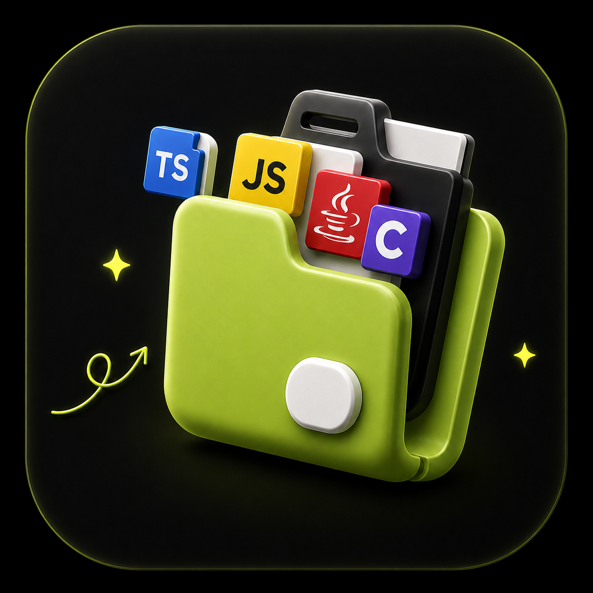

<div align="center">
  
  <h1>🚀 DevNest AI</h1>
  <p><strong>Your Ultimate Offline-First Code Snippet Manager powered by Gemini AI.</strong></p>

  [](#)
  [](#)
  [](#)
  [](#)
  [](#)
  <br/><br/>
  [](https://expo.dev/accounts/himu21/projects/devnest/builds/ed19172e-efb2-4f50-9469-7aa61fc0b2e1)
</div>

<br />

Welcome to **DevNest AI**, a premium, high-performance mobile application designed specifically for developers to store, manage, and analyze code snippets on the go. DevNest is built with an **Offline-First** architecture ensuring your code is always accessible, while integrating seamlessly with **Google Gemini AI** for code explanation, optimization, and bug fixing.

---

## ✨ Key Features
- 🔒 **100% Offline First:** Built with Expo SQLite. Your data never leaves your device unless you want it to.
- 🤖 **Gemini AI Integration:** Select from `gemini-2.5-flash`, `gemma-4-26b`, and other models to analyze, refactor, or explain your snippets.
- 📸 **Code Scanner (OCR):** Upload an image of code and instantly extract the text using AI Vision models.
- 📂 **Folder Management:** Organize your snippets neatly into color-coded folders.
- 🗑️ **Trash & Recovery System:** Safely delete snippets and restore them if needed.
- 🎨 **Premium UI/UX:** Stunning Dark Mode, Glassmorphism effects, Haptic Feedback, and smooth animations (Reanimated 4).

---

## 📦 Download & Install
Want to try out DevNest AI on your Android device? 

<p align="center">
  
  <br/>
  <i>Scan to Download or Click Below</i>
</p>

👉 **[Download the Latest APK Here](https://expo.dev/accounts/himu21/projects/devnest/builds/ed19172e-efb2-4f50-9469-7aa61fc0b2e1)**

*Note: You may need to allow "Install from Unknown Sources" in your Android settings to install the APK.*

---

## 📖 Comprehensive User Guide & Walkthrough
*(Note: Place your actual screenshots in the `assets/screenshots` folder)*

### 1. 🚀 First Launch (Onboarding & Profile)
When you open DevNest AI for the first time, you will be greeted by a smooth onboarding experience.
- **Swipe through the intro screens** to understand what DevNest AI offers.
- **Profile Setup:** Enter your Display Name and pick a cool 3D Avatar from the grid. This makes the app feel personalized.
<p align="center">
   &nbsp;
   &nbsp;
  
</p>
<p align="center">
   &nbsp;
   &nbsp;
  
</p>
<p align="center">
   &nbsp;
   &nbsp;
  
</p>

### 2. 🏠 The Home Screen
Your central dashboard, greeting you dynamically based on the time of day (e.g., "Hello Night Owl" or "Good Morning").
- **Quick Actions:** Use the pill buttons at the top to instantly **Create a Snippet**, **Scan Code via Camera**, **Import a File**, or open the **AI History**.
- **Stats Overview:** Check your total Folders, Snippets, and AI Insights at a glance.
- **Recent Snippets:** Quickly access the code you were just working on.
>  &nbsp;&nbsp;&nbsp;&nbsp; 

### 3. ✍️ Creating & Editing Snippets
There are 3 ways to create a snippet in DevNest:
- **Manual Entry:** Click "New Snippet", type or paste your code, add a title, select a programming language, and assign a Folder.
- **Scan Code (OCR AI):** Click "Scan Code" on the Home Screen. This opens your **native device camera**. Take a picture of code from a laptop or book, and DevNest uses Gemini Vision AI to extract the text and convert it into an editable snippet!
- **File Import:** Import `.txt`, `.json`, `.js`, or `.py` files directly from your phone's storage.
>  &nbsp;&nbsp;&nbsp;&nbsp; 

### 4. 👁️ Viewing Snippets (Syntax Highlighting)
When you tap on any snippet, you enter the Snippet Details Screen.
- **Rich Syntax Highlighting:** Code is rendered beautifully based on its programming language.
- **Copy to Clipboard:** One-tap button to copy the entire code.
- **Export/Share:** Export the code as a physical file to your device or share it via social apps.
<p align="center">
   &nbsp;
  
</p>

### 5. 🧠 Chat with AI (Smart Code Insights)
DevNest isn't just a notepad; it's an AI Pair Programmer.
- Open any saved snippet and look at the bottom action bar.
- Click **Explain** to get a line-by-line breakdown of what the code does.
- Click **Refactor**, **Optimize**, or **Debug** to have Gemini analyze your code and suggest improvements.
- A beautiful modal will pop up displaying the AI's response with syntax-highlighted markdown.
- **Save Insights:** You can save these AI conversations to your "AI History" tab so you never lose a good explanation.
<p align="center">
   &nbsp;
   &nbsp;
  
</p>
<p align="center">
   &nbsp;
  
</p>

### 5. 📂 File Manager & Folders
Keep your workspace organized.
- Navigate to the **Folders Tab**.
- Click the **"+" icon** to create a new folder. You can name it and pick a custom hex color.
- Folders are rendered with stunning **3D Glassmorphism** effects that adapt to your chosen color.
- Click on any folder to view all snippets stored inside it.
>  &nbsp;&nbsp;&nbsp;&nbsp; 

### 6. 🔍 Search & Explore
Never lose a piece of code again.
- Head to the **Search Tab**. 
- Type keywords to instantly filter through hundreds of snippets. The search is powered by SQLite, meaning it is **lightning fast** and works 100% offline.
>  &nbsp;&nbsp;&nbsp;&nbsp; 

### 7. 🗑️ Trash & Recovery System
Accidentally deleted a snippet? Don't panic.
- Go to your Profile and click **Trash**.
- You will see all recently deleted snippets.
- You can either **Restore** them back to their folders or **Delete Permanently**.
<p align="center">
   &nbsp;
   &nbsp;
  
</p>
<p align="center">
   &nbsp;
   &nbsp;
  
</p>

### 8. ⚙️ Profile & Settings
Customize your experience to the max.
- **Profile Tab:** View your coding streak (Day Streak), your Level, and a progress bar showing how close you are to your next Snippet Milestone.
- **Settings:** 
  - **AI Model Setup:** Choose which AI model powers your app. Select `gemini-2.5-flash` for speed, `gemma-4-26b` for heavy text tasks, or `gemini-2.5-pro` for advanced logic.
  - **API Key:** Safely enter your personal Google Gemini API Key. It is encrypted and stored locally via `expo-secure-store`.
  - **UI Themes:** Toggle between system-default or forced Dark Mode.
>  &nbsp;&nbsp;&nbsp;&nbsp; 
>  &nbsp;&nbsp;&nbsp;&nbsp; 

---

## 🛠️ Tech Stack
* **Framework:** React Native / Expo (SDK 55)
* **Routing:** Expo Router (File-based navigation)
* **Styling:** Custom StyleSheet + Selected NativeWind features
* **State Management:** Zustand
* **Database:** Expo SQLite
* **AI Provider:** `@google/generative-ai` (REST API Fallback for React Native)
* **Storage:** Expo SecureStore & AsyncStorage
* **Animations:** React Native Reanimated & React Native Gesture Handler

---

## 🚀 How to Clone, Setup, & Run Locally

Follow these instructions to run the DevNest AI app on your own machine.

### 1. Clone the Repository
```bash
git clone https://github.com/your-username/DevNest-AI.git
cd DevNest-AI
```

### 2. Install Dependencies
Make sure you have Node.js installed. We recommend using `npm` with `--legacy-peer-deps` if you encounter React version conflicts.
```bash
npm install --legacy-peer-deps
```

### 3. Setup Environment Variables (`.env`)
You need a Google Gemini API Key to use the AI features.
1. Go to [Google AI Studio](https://aistudio.google.com/) and create an API Key.
2. In the root folder of this project, create a file named `.env`.
3. Add your API key like this:
```env
EXPO_PUBLIC_GEMINI_API_KEY=your_api_key_here
```
*(The app also allows users to input their personal API key directly inside the App Settings, which overrides the `.env` key).*

### 4. Start the App
Start the Expo Metro Bundler:
```bash
npx expo start -c
```
- Press **`a`** to open the app on an Android Emulator.
- Press **`i`** to open on an iOS Simulator.
- Scan the **QR Code** with the *Expo Go* app on your physical mobile device.

---

## 📦 Building for Production (APK / AAB)

This project is configured with `eas.json` to build directly for Android.

**To build a shareable APK:**
```bash
npm install -g eas-cli
eas login
eas build -p android --profile preview
```

**To build an AAB (For Google Play Store):**
```bash
eas build -p android --profile production
```

---

## 🤝 Contributing
Feel free to open an issue or submit a pull request if you want to add new features or fix bugs. 

## 📄 License
This project is for educational and personal use. Feel free to modify and build upon it!
